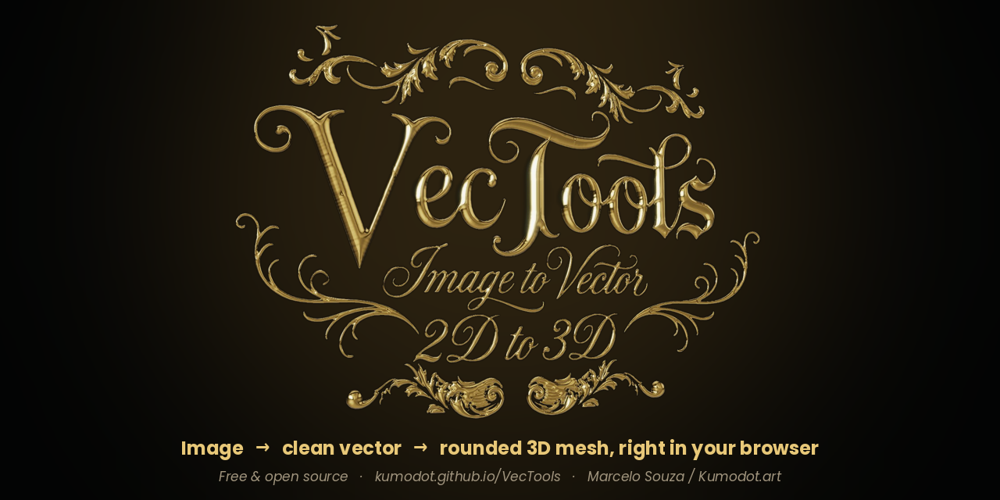
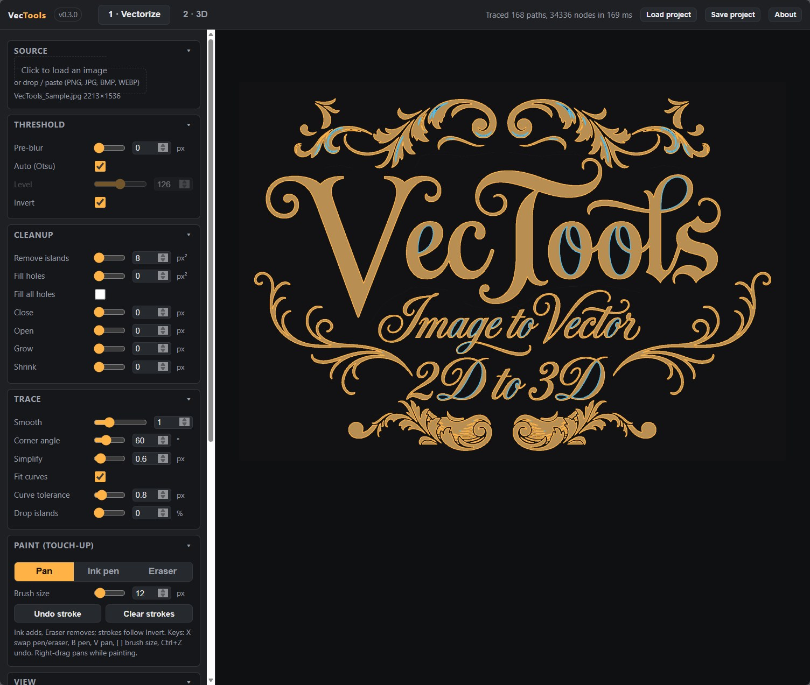
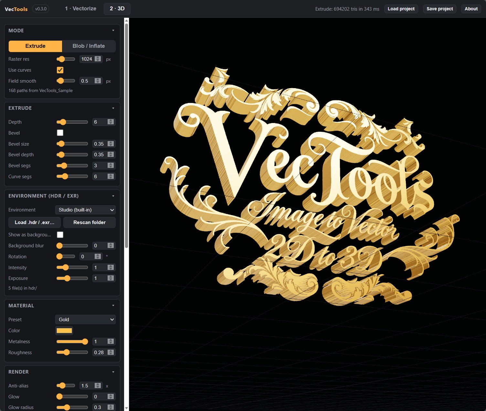
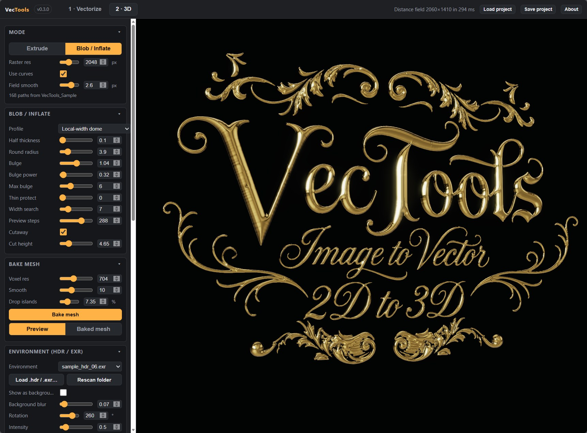

<p align="center"></p>

# VecTools

**Image → clean vector → rounded 3D mesh, in your browser.**
Drop a black & white logo or lettering, tune the trace, then inflate it into a "chocolate bar / Wonka" style rounded mesh with a realtime preview, and export STL / OBJ / PLY for Blender, Houdini or your slicer.

Single-page web app, no build step, no server side, nothing leaves your machine.

**Marcelo Souza / Kumodot.art - 2026 // @Msouza3d**
If this saves you time: [Support Marcelo Souza on Ko-fi](https://ko-fi.com/msouza3d)

**Try it now:** [kumodot.github.io/VecTools](https://kumodot.github.io/VecTools/)

## Screenshots

| Vectorize | Extrude | Blob / Inflate |
|---|---|---|
|  |  |  |

The lettering above is `Samples/VecTools_Sample.jpg` traced and inflated with the *Local-width dome* profile, lit by one of the bundled EXRs.

## Run it

**Local (recommended):** download / clone, double-click `RUN_VecTools_v0.3.0.bat`. It starts `python -m http.server` on port 8765 and opens the app. Python 3 required (ES modules and Web Workers do not load from `file://`). On macOS/Linux: `python3 -m http.server 8765` in the folder, then open `http://localhost:8765/`.

**Hosted:** it is a static site, so any static host works. `index.html` redirects to the current versioned entry file.

Try it with the images in `Samples/`.

## Workflow

### 1 · Vectorize
- Drop, paste or pick an image. White-on-black is detected automatically (*Invert*).
- **Threshold**: pre-blur, Otsu or manual level.
- **Cleanup**: remove islands, fill holes, morphological close / open / grow / shrink.
- **Trace**: corner-aware smoothing (sharp corners stay sharp), simplify, cubic Bézier fit, *Drop islands* by relative area.
- **Paint**: Ink pen / Eraser to touch up the source. `X` swap, `B` pen, `V` pan, `[` `]` brush size, `Ctrl+Z` undo.
- Export **SVG** (even-odd fill) or **DXF**, or *Send to 3D*.

### 2 · 3D
- **Extrude**: classic extrude with optional inset bevel.
- **Blob / Inflate**: the good part. The vector becomes a signed distance field and gets a rounded profile:
  - *Rounded extrude*: flat slab with a filleted edge. Strokes thinner than the fillet automatically turn into thinner rounded tubes, so hairlines never become fins.
  - *Pillow / dome* and *Local-width dome*: puffier profiles.
  - Realtime GPU raymarch preview while you drag sliders, then **Bake mesh** (marching cubes + smoothing + island cleanup).
- **Environment**: drop `.hdr` / `.exr` maps in `hdr/` (or load one), rotation, intensity, exposure, HDR background.
- **Material**: presets or custom color / metalness / roughness.
- **Render**: supersampled anti-aliasing, glow, wireframe, flat shading, floor grid.
- **Navigation**: Orbit or Fly (W/A/S/D + mouse look, pointer lock), *Laziness* eases the camera.
- **Capture PNG** at 1x-4x, optionally transparent.
- Export **STL**, **OBJ**, **PLY**. Units: longest side = 100, rescale in your 3D app.

### Projects
*Save project* writes a `.vtools` JSON with every 2D + 3D setting. *Load project* (or drop the file on the app) re-applies them to whatever image is loaded.

## Tech notes
- Trace: marching squares with hole nesting, Chaikin with corner threshold, closed-loop RDP, Schneider Bézier fitting. All in a Web Worker.
- 3D: exact Euclidean distance transform → 3D SDF (rounded box in the distance/height plane) → GLSL raymarch preview → marching cubes bake → Taubin smoothing. Three.js for display, PMREM environments, bloom.
- Self-tests: `node docs/trace-selftest.mjs`, `node docs/mesh-selftest.mjs`.

## Layout
```
index.html               static-host entry (redirects to the versioned app)
VecTools_vX.Y.Z.html     the app (version in the file name and header)
RUN_VecTools_vX.Y.Z.bat  local launcher
js/                      app code (trace/ = vectorize pipeline, three/ = 3D pipeline)
vendor/                  three.js + addons (vendored, no build step)
hdr/                     environment maps + index.json
Samples/                 test images
screenshots/             README images + share banner
docs/                    self-tests, release notes
```

## License
MIT. Bundles three.js (MIT). See `LICENSE`.
